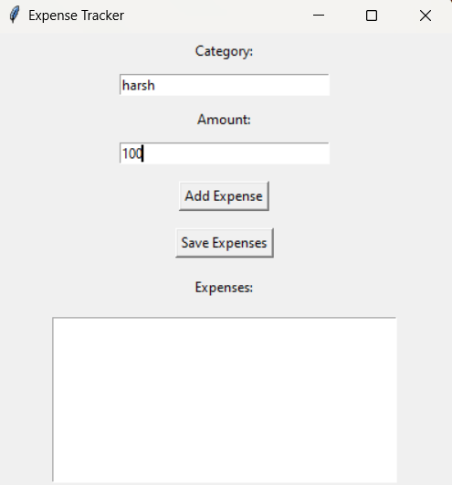

# Expense Tracker

**Description**

A simple GUI application to track and manage expenses. Users can add expenses, view their expense history, and save data for future use.

---

### Features

- Add new expenses by category and amount.
- View all recorded expenses with a total calculation.
- Save and load expenses from a file.
  
### Requirements

- Python 3.x
- No additional libraries required.

---

### How to Run

- Save the code as

```bash
expense_tracker.py.
```

- Run the script:

---

### bash

- Copy code

```bash
python expense_tracker.py
```

### Screen Shot



### How to Use
- Choose an option from the menu:
- Add an expense.
- View recorded expenses.
- Save and exit.
  
**Expenses are saved to expenses.txt automatically upon exit.**
